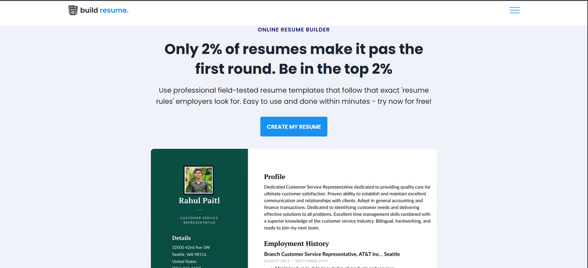
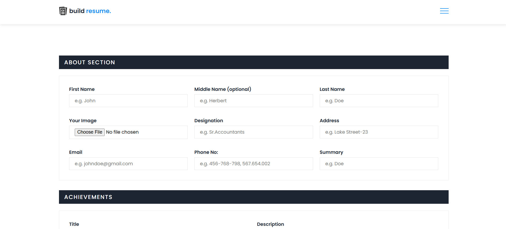
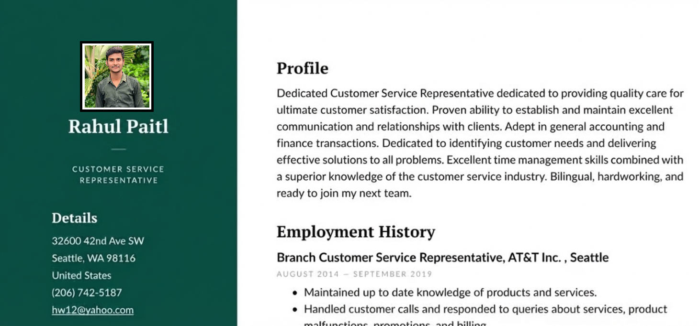

<h1 align="center">✨ AI Powered Resume Builder</h1>

  
  
  

  

---

## 📌 Project Overview

The **AI Resume Builder** is a simple and clean web-based tool that allows users to  
create **professional resumes** quickly using an easy input form and auto-generated template.

The design is responsive, includes animations, and works entirely on the frontend.

---

## ✨ Features

- ✔ Easy-to-use input form  
- ✔ Auto-generated resume template  
- ✔ Fully responsive design  
- ✔ Smooth CSS animations  
- ✔ Download or print resume  
- ✔ 100% frontend (no backend required)  
- ✔ Organized folder structure  

---

## 🛠 Technologies Used

| Technology | Purpose |
|-----------|----------|
| **HTML5** | Layout & Structure |
| **CSS3** | Styling + Animations |
| **JavaScript** | Form Handling + Resume Generation |

## 📸 Screenshots

After adding your images inside the `/assets/images/` folder, update the filenames below:

### 🏠 Home Page

### 📝 Form Page

### 📄 Resume Preview

---

## ⭐ Support

If you like this project, please give it a star ⭐ on GitHub!

---

## 👨‍💻 Author

**Rahul Patil**  
📧 Email: rgpatil9307@gmail.com  
GitHub: [Rahul-9307](https://github.com/Rahul-9307)

<b>🎉 Thank you for using this Tech_Rahul... 🎉</b>

